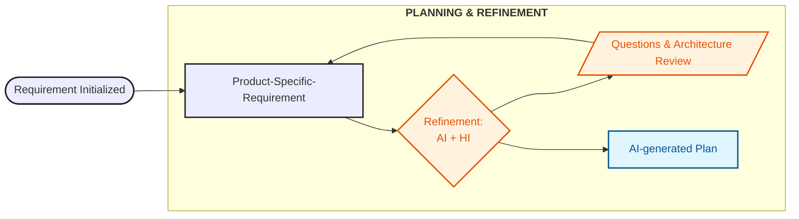
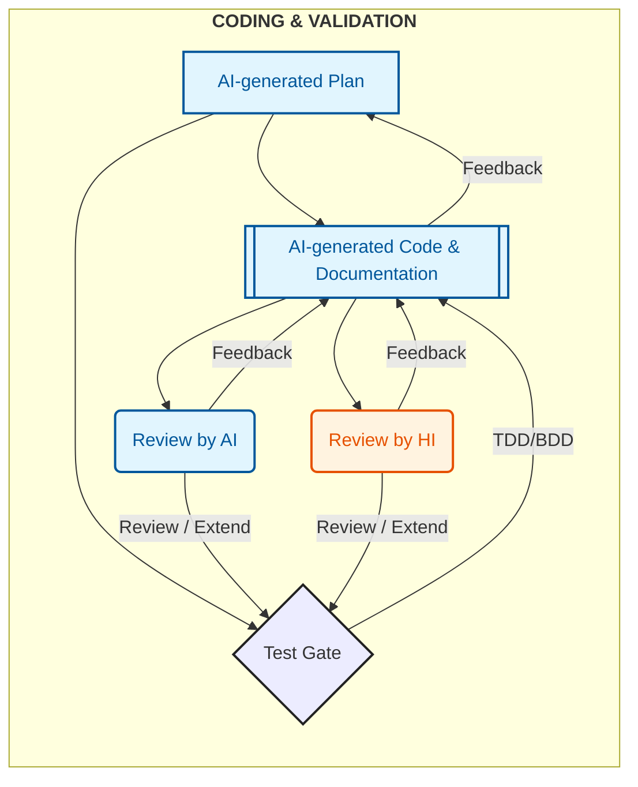
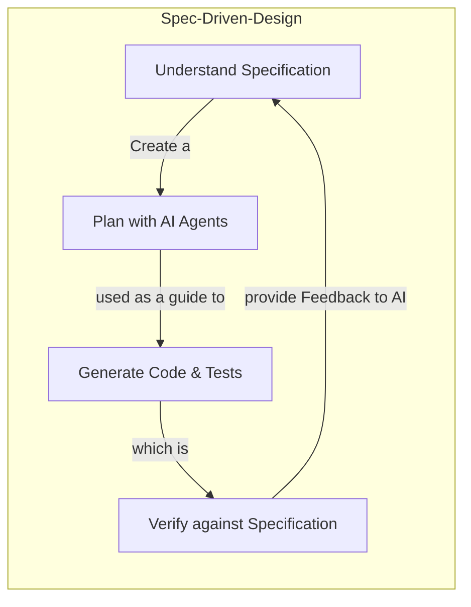

# AI-Driven Development: No shit, Sherlock! 🚀

---

## What is AI in the Software Development Lifecycle (SDLC)?

AI in SDLC is a system that can **assist** the following roles:

- **Developers** in writing, reviewing, and testing code
- **Quality Assurance Engineers** in generating test cases and automating testing processes
- **DevOps Engineers** in automating deployment and monitoring tasks
- **Project Managers** in tracking progress and managing resources
- **Business Analysts** in gathering and analyzing requirements
- **UX Designers** in creating user interfaces and experiences
- **Technical Writers** in generating documentation
- **Security Analysts** in identifying vulnerabilities and suggesting fixes
- **Data Scientists** in analyzing data and generating insights

_You got the idea.._

---

## How it works

All of this is only possible because AI models have been trained on vast amounts of code from public repositories, documentation, and other resources.
Today, various AI models are available—such as GPT-*, Claude, and Gemini—each with its own strengths and weaknesses.
Additionally, the context provided, as you may already know, is crucial for generating output of **high quality**.

### 💩 Shit In Shit Out

**Quality** is one key aspect in Software Engineering—the same applies to AI.
If you provide 💩 input, you will most certainly get 💩 output.

>✅ So let's be mindful and **avoid Shit In Shit Out**!  
> If this statement is unfamiliar to you and you have never tried any kind of AI application or agent:
> - ⏸️ Immediately pause reading the article here.
> - 👆🏾 Play around with any AI tool of your choice.
> - 💭 Make up your own picture about what AI is.

### 🤔 What are the capabilities and limitations of using AI?

As you might have realized...

- **Modern AI excels at:** natural language understanding, pattern recognition, and automating repetitive tasks
- **Current limitations:** AI lacks intrinsic accountability, is susceptible to hallucinations, and depends heavily on data quality

With these preconditions and knowledge about AI, we can transform this **tool** into one capable of performing tasks that typically require Human Intelligence (HI).

---

## Deterministic vs. Probabilistic

If you consider what **Spring Boot** or **Angular** actually are, the answer becomes obvious.
They are **opinionated and deterministic frameworks**, designed by engineers for engineers.
Their rules, conventions, and constraints define the entire project structure so that:

- builds are reproducible,
- behavior is predictable,
- and the output is identical on any machine—for both backends and UIs.

This determinism is what enables software to scale across teams, environments, and years.

AI is **probabilistic by nature**. It produces *likely* outputs, not guaranteed ones. 
Our software systems or even the product it-self requires **determinism** to ensure reliability, maintainability, and security.
  
That is why AI must operate **within deterministic systems**, rather than replace them.

## How Context Adds Determinism in the AI World

As I mentioned earlier, **context** is important for getting high-quality output from AI.

In a small experiment, I developed a Gym Diary App to track one's gym progress using the following AI models and tools:
- **Without context:** ChatGPT which does not have access to my project codebase
- **With context:** GitHub Copilot, used as an IDE extension and had access to the entire project codebase
- **AI-native IDE:** Cursor Desktop, providing a full IDE experience with AI agents

The results were quite interesting:

| AI Tool / Model | Context Access      | Output Quality |
|-----------------|---------------------|----------------|
| ChatGPT         | None                | Low            |
| GitHub Copilot  | Project Codebase    | Medium         |
| Cursor Desktop  | Full IDE Experience | High           |

I used the tools above to generate code for a simple feature, as described below:
> Add a new endpoint to fetch gym diary details by category for a specific user.

### No Context - ChatGPT

No matter which ChatGPT model I chose, the output was similar:
- It generated code snippets that were syntactically correct but did not align with the project's architecture or coding standards.
- It missed important details such as error handling, logging, security considerations, database setup and more.
- e.g. Example ChatGPT output (without context):
  > To add a new endpoint to fetch gym diary details by category for a specific user in a Spring Boot + Kotlin application, we need to define:
  > 1. **Controller endpoint** 
  > 2. **Service method** 
  > 3. **Repository query** 
  > 
  > Here’s a clean and maintainable approach: [...]

Basically, it started generating code right away, without any prior knowledge of the project.
Providing context to ChatGPT could have improved the  quality of the output, but the effort didn't always seem worth it, since sometimes I was faster writing the code by myself.

### With Context - GitHub Copilot / Cursor Desktop

Compared to ChatGPT, agentic AI tools like GitHub Copilot and Cursor Desktop were game changers:
- GitHub Copilot, with access to the project codebase, produced code that was better aligned with the project's architecture and coding standards.
- Cursor Desktop, with its full IDE experience, generated code that was not only correct but also well-integrated into the existing codebase, following best practices and conventions which already existed in the project.

> To make these tools work, you need to configure them properly so they understand the project architecture, coding standards, and other relevant details.

### Ok, but how do you use AI in the SDLC?

To effectively integrate AI into the Software Development Lifecycle (SDLC), we can adopt the **AI-Driven Development (AIDD)** approach.

> AI-Driven Development (AIDD) is a methodology that leverages AI tools to augment human capabilities throughout the software development process.

Let's take a look at the AIDD Hourglass Strategy.

---

## ⏳ The AIDD Hourglass Strategy (Test Gate)

AI is able to quickly generate code that aligns with the project—if the right context is provided.
Generating code is one thing, but ensuring its quality and reliability is another. So yes, we need tests! And AI can help us here as well.

These kind of tests are typically Unit Tests, ensuring that each Unit (_however you define a Unit in your codespace_) works as expected.
As we often discuss in Software Engineering, what Unit Tests are, the definition of it should be explicitly stated in your project guidelines or agreed upon by your team. 
Later, AI can follow these guidelines when generating new Unit Tests.
The same can be applied to Integration Tests, Acceptance Tests, and E2E Tests.

The **risk of generating code** and **tests with AI** is that they might not align with the overall architecture, non-functional requirements, or even meet the actual business requirements.
To close this gap, we need to **add documentation about the architecture and other guidelines as markdown files** within the project, and introduce a **Test Gate: AIDD Hourglass Strategy.** 

In the **AIDD Hourglass Strategy** as illustrated below, the testing and development lifecycle follows an **Hourglass** shape to balance **Human Intelligence (HI)** and **Artificial Intelligence (AI)**.

The Hourglass Model has three parts—a lower bulb, a neck, and an upper bulb—which we’ll explore in detail in the following sections.

#### 1. Lower Bulb — AI Base: High-Volume Unit Testing

* **Focus:** Unit Tests
* **AI’s Role:** AI is highly efficient at generating repetitive test scaffolding and covering edge cases for discrete functions
* **Benefit:** It reduces the "toil" of writing tests manually, enabling faster feedback cycles

#### 2. Neck — Integration & Acceptance

* **Focus:** Integration and Acceptance Tests
* **The Hand-off:** This is where AI-generated code meets human-designed architecture. Humans must validate architectural boundaries and ensure non-functional requirements are met

#### 3. Upper Bulb — The HI Peak: E2E and Manual Testing

* **Focus:** E2E-Tests and Manual-Tests
* **HI’s Role:** Humans are essential for assessing user experience, business context, and "true intent"—areas where AI falls short.
* **Future Potential:** As AI models advance, they are likely to assume greater responsibilities once we establish an efficient way to provide them with sufficient business context.

### The Hourglass Model in Practice

This Hourglass model is exactly what I experienced in my GymDiary project as well.

The GymDiary project was initially built without any AI assistance.
When I introduced AI to generate code and tests, I observed the following:

- **Unit Tests:** AI-generated unit tests were comprehensive, covering many edge cases, significantly reducing the time spent on writing tests manually
- **Integration Tests:** The hands-off implementation required careful review to ensure that AI-generated code adhered to the business requirements. AI did not know how the downstream services were working, as it lacked the necessary context.
- **E2E Tests:** Even if the contract was validated at the Integration Test level, the E2E tests revealed gaps in user flows and business logic that AI could not anticipate. Some features did not work as expected because AI misunderstood the business requirements. The E2E tests ensured that the overall system worked as intended from a user's perspective.

By using the contexts and the outputs of the generated tests as feedback loops in the AIDD workflow, you can ensure that AI-generated code meets the required quality standards and aligns with the overall architecture and business requirements.
Not only tests, but also reviews—by both HI and AI—can serve as feedback loops to improve the quality of AI-generated code.
Last but not least, the requirement it-self can be used as a contextual artifact to ensure that the generated code meets the business needs.

Combining all these elements creates a full AIDD workflow which is depicted below.

---

## 🤖 The AIDD Workflow

### DevOps Loop

A sustainable AIDD workflow integrates AI into the existing DevOps loop as an augmentation layer.

#### Planning & Refinement

In this phase, AI assists in refining requirements by asking questions and generating plans, while humans ensure the integrity of the architecture.

#### Coding & Validation

AI generates code and documentation, with a Test Gate ensuring quality through reviews and tests performed by both AI and humans.

#### Release & Monitoring

The deployment and monitoring phase is largely human-driven, with AI providing insights and automating routine tasks within the CI/CD pipeline.

All in all, it's just an **augmentation layer** on top of the existing DevOps processes.

Yes, now you would say this sounds great, but how do we ensure that the generated code meets the actual business requirements?
Spec-Driven-Development (SDD) is the answer.

### Spec-Driven Development (SDD) in AIDD

SDD is an evolution of Behavior-Driven-Development (BDD) where specifications are used as the primary source of truth for development.
This is especially important in the AIDD workflow, as AI can generate code based on specifications, ensuring that the implementation aligns with the desired behavior.

To ensure, AI can understand specifications, they need to be written in a clear and structured format—such as Markdown—and provided to the AI model as context.
In my GymDiary project, I used AI to generate specifications based on the initial requirements, saved them as Markdown files in the repository, and used those specifications to guide AI in generating code and tests.
All this falls into the first phase of the AIDD workflow: **Planning & Refinement.**

One problem that will arise here is the quality of the specifications and their maintenance over time.
Can this be solved with MCP Servers or Retrieval-Augmented Generation (RAG) techniques—or do we need to invent a completely new approach?

_Maybe that’s a topic for another article._

---

## 📝 Conclusion: AI will NOT replace Software Engineers, but will make them more productive!

AI is a powerful tool that can augment human capabilities in software development.
By integrating AI into the SDLC through the AIDD approach, we can leverage AI's strengths while mitigating its limitations.
The AIDD Hourglass Strategy ensures that AI-generated code meets quality standards through a Test Gate, while the AIDD Workflow integrates AI into existing CI/CD processes.
Ultimately, AI will not replace software engineers—it will make them more productive.

What are your thoughts and experiences on this topic?
