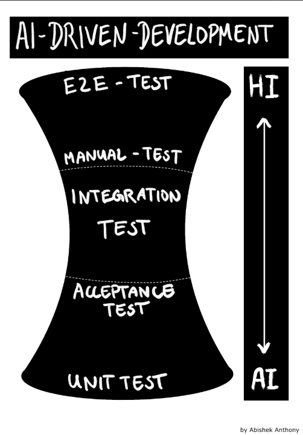
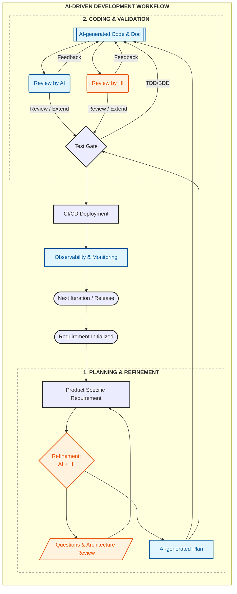

# AI-Driven Development: Gamechanger or Hype?

Artificial Intelligence is transforming software development. 
This guide explores how AI-driven tools are reshaping the DevOps Cycle—from coding to testing and deployment—while maintaining engineering discipline.

---

## ℹ️ Introduction: Artificial Intelligence (AI)

### 🤔 What is it?
AI refers to computational systems capable of performing tasks that typically require human intelligence. 
These systems learn from data, reason under uncertainty, and act toward specific goals.

> **Important:** AI optimizes for patterns and likelihood—**not correctness, intent, or architectural quality**.

### 👾 Capabilities & Limitations
* **Modern AI excels at:** Natural language understanding, pattern recognition, and automating repetitive tasks.
* **Current Limitations:** AI lacks intrinsic accountability, is susceptible to hallucinations, and depends heavily on data quality.

---

## ⏳ The AIDD Hourglass Strategy (Test Gate)
In AI-Driven Development (AIDD), the testing and development lifecycle follows an **Hourglass** shape to balance **Human Intelligence (HI)** and **Artificial Intelligence (AI)**.

### 1. The AI Base: High-Volume Unit Testing
* **Focus:** Unit Tests.
* **AI’s Role:** AI is highly efficient at generating repetitive test scaffolding and covering edge cases for discrete functions.
* **Benefit:** It reduces the "toil" of manual test writing, allowing for faster feedback cycles.

### 2. The Narrow "Neck": Integration & Acceptance
* **Focus:** Integration and Acceptance Tests.
* **The Hand-off:** This is where AI-generated code meets human-designed architecture. Humans must validate architectural boundaries and non-functional requirements.

### 3. The HI Peak: E2E and Manual Testing
* **Focus:** E2E-Tests and Manual-Tests.
* **HI’s Role:** Humans are essential for assessing user experience, business context, and "true intent"—areas where AI lacks understanding.
---

## 🤖 The AIDD Workflow
A sustainable AIDD workflow integrates AI into the existing CI/CD loop as an **augmentation layer**.

### 📈 Impact and Productivity
According to 2024 / 2025 DORA Reports, AI increases developer productivity by reducing repetitive work. 

However, teams must remain vigilant:
- Technical Debt Risk: High if AI output isn’t reviewed. 
- False Confidence: AI can produce fluent but incorrect outputs.
- Engineering Discipline: Successful projects require strong engineering discipline first, AI second.

> ### 📝 Conclusion
> **AI-Driven Development is a game changer** when embedded in strong engineering practices and used to automate low-value work.
> 
> 🚨 It becomes dangerous hype when treated as an authority or used as a shortcut for thinking.